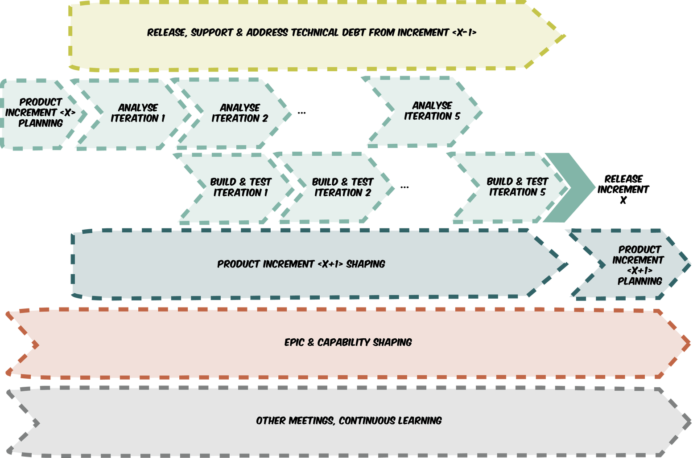
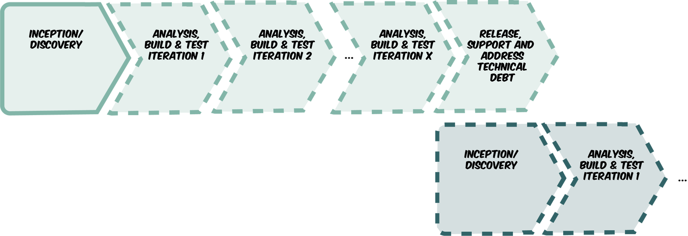
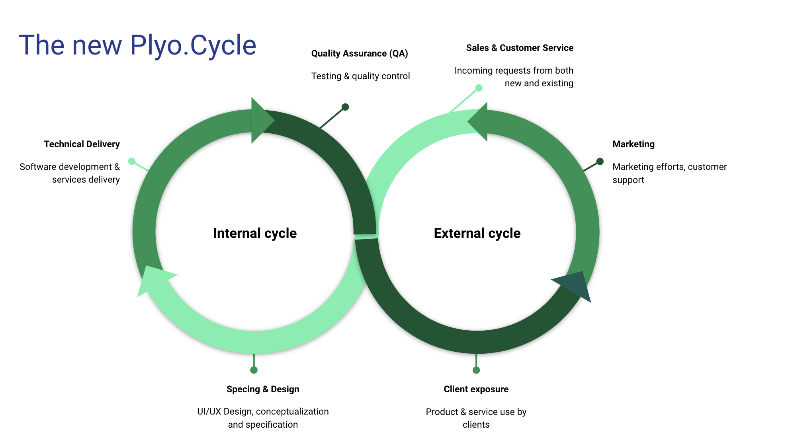

---?color=linear-gradient(to right, #c02425, #f0cb35)
@title[Introduction]

@snap[west headline text-white]
Pipeline Management
@size[0.5em](*What is it, and why do we need it*)
@snapend

@snap[south-west byline  text-white]
The Fastest Way From Idea To Presentation.
@snapend

---
## The Challenge

> We're doing many things at once and we have too little control of what's next

+++
### Symptoms
@ul
- Ever-growing backlog
- Current sprint is moving target
- Next/future sprint(s) in constant evolvement
- Future epic delivery timeframe keeps getting pushed
@ulend

> @css[fragment](In other words, we're often behind)

+++
### Why is that?
These factors/incidents contribute to this situation:

@ul
- Client processes dictate our priorities (to a too large degree)
- Delivery specifications are too vague, or misunderstanding has occured
- Estimates are way off - things take much longer than we expect
- "Polishing phase bleed" - we're responding to client feedback way beyond handoff/delivery date
@ulend

+++
### Current sales funnel

+++
### Resulting pipeline

+++
*Multi-track delivery pipeline*

+++
### How this affects dev cycle
@ul
- Constant context switching
- Too little epic preparation time
- Just-in-time design process
	- Little room for feedback
- Patch-work approach to new features
@ulend

+++
### Ideal pipeline

---
## The Solution

+++
## Internal changes
### Practice & process

+++
### Sales
- Being honest with clients
- Less prone to pressure from clients
	- aka. Being Honest/Professional/Confident
- Including "feedback and improvement" cycle in delivery plan

+++
### Dev
- More accurate estimates
	- "Know your self" - determine accurate team velocity
- Higher capacity - more devs!
- Lower overhead - less bugs!

+++
## Internal changes
### Framework & implementation

+++
*Linear delivery pipeline ("just in time" flow)*

+++
### Framework & implementation cont'd.
@ul
- Fixed sprints (start and end-dates)
- Set story points in Jira (epic "weight")
	- To accurately determine velocity, over time
- Time tracking in Jira
- Retrospectives, to continuosly monitor dev cycle health
@ulend

+++
## Project pipeline changes
+++
### Current sales pipeline at Plyo
1. Sales pitch (intro sales meeting)
2. Further client input
3. Proposal writing
4. Waiting...
5. Signing?

+++
#### Current delivery lifecycle at Plyo
1. Feature design (UI, UX) based on client needs
2. Estimatations
3. Proposal writing
4. Acceptance?
5. Dev!

+++

+++
#### Ideal sales pipeline at Plyo
1. Introductory sales meeting
2. Further client input
3. Sales pitch meeting
4. Design and specification
5. Acceptance
6. Proposal writing
7. Optional: Pilot project to assess risk
8. Signing

---
## Summary
+++
### Sales team
- Refinements to sales/proposal process
- More time for specifications and design
- Pilot project if necessary
- Full pricing at a later stage
- Under-promise rather than under-deliver

+++
### Management
- Fixed sprints
- More strict
	- pipeline management
	- estimate evaluation
	- QA & feedback phase
- Take time for retrospects

+++
### Dev team
- Keep tracking time accurately
- Continuous evaluation of Team Velocity
- Estimation & analyzation is part of the dev cycle

---
## Questions?

